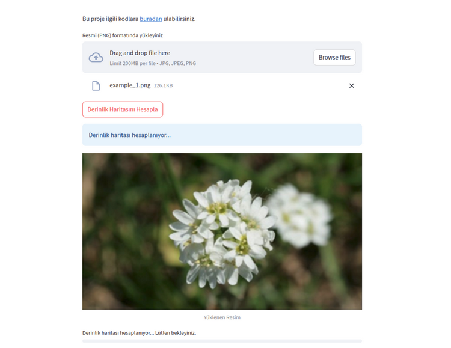
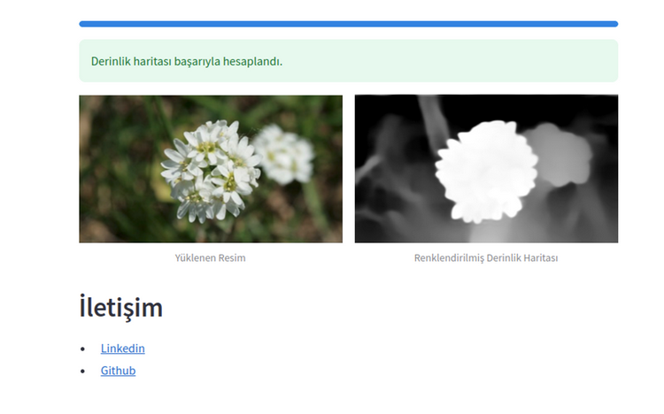

# Depth Estimation Streamlit

This repository contains the code for a depth estimation project using Streamlit. 

## Overview
The Depth Estimation Streamlit project aims to provide a user-friendly interface for estimating depth from images. It utilizes deep learning techniques to generate accurate depth maps.

## Features
- Easy-to-use interface
- Real-time depth estimation
- Support for various image formats
- Adjustable parameters for fine-tuning results

## Installation
To run this project, follow these steps:

1. Clone the repository:
```
git clone https://github.com/Yusuf-Cizlasmak/Depth_Estimation_Streamlit.git
```

2. Install the required dependencies:
```
pip install -r requirements.txt
```
3. CLI

The Depth Estimation Streamlit project also provides a Command Line Interface (CLI) for running depth estimation on images. To use the CLI, follow these steps:

```
usage: cli.py [-h] [-ip IMAGE_PATH] [-op OUTPUT_PATH]

Depth Map

options:
  -h, --help            show this help message and exit
  -ip IMAGE_PATH, --image_path IMAGE_PATH
                        Path to the image
  -op OUTPUT_PATH, --output_path OUTPUT_PATH
                        Path to save the colored depth map
```


4. Run the Streamlit app:
```
streamlit run main.py
```

## Usage
1. Upload an image using the provided interface.
2. Adjust the parameters if needed.
3. Click on the "Estimate Depth" button to generate the depth map.
4. View and analyze the depth map.


## Example

